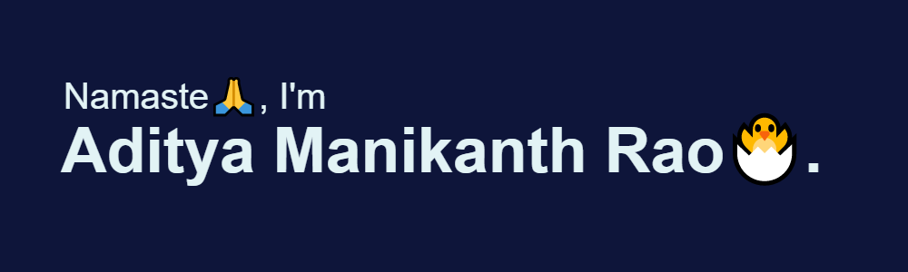

  

## I'm a Full Stack Developer!!

- 👨🏼‍🎓 Graduate from MVSR Engineering College, Hyderabad in B.E Computer Science.

- 👨🏽‍💻 JavaScript Guy.

- 💻 Full Stack Engineer at [MockTheta, Inc.](https://mocktheta.co/)

- 🧑‍🤝‍🧑 Love connecting with different people❤️.

- 👨🏻‍🎤 Music is love!! and so is [Arijit Singh](https://open.spotify.com/artist/4YRxDV8wJFPHPTeXepOstw?autoplay=true).

- Enjoy learning and knowing new technologies and stuff😎.

---

## Tools and Technologies:

---

---

## Technologies/ Concepts that I am currently learning:

- Go Lang

- GraphQL

- System Design

- Micro-Services

---

## Connect with me:

[][gmail-id]
[][linkedin-link]
[][twitter-link]
[][instagram-link]

[gmail-id]: mailto:adityamanikanthrao@gmail.com
[instagram-link]: https://www.instagram.com/aditya_theawsm1/
[twitter-link]: https://twitter.com/rao_manikanth
[linkedin-link]: https://www.linkedin.com/in/aditya-manikanth-rao-11874819a/

---

## 🐾 Next Steps:

Since you have made it till the end (almost), why don't you show me some love by

- 👨🏼‍🏫 - Suggest or Mentor me so I can get better at what I do.
- 🖥️ - Offer some work maybe.
- 📣 - Follow me on Github and give a star to my projects that you liked.
- 🤝🏼 - DM me on LinkedIn to connect or ... just Email.

---
